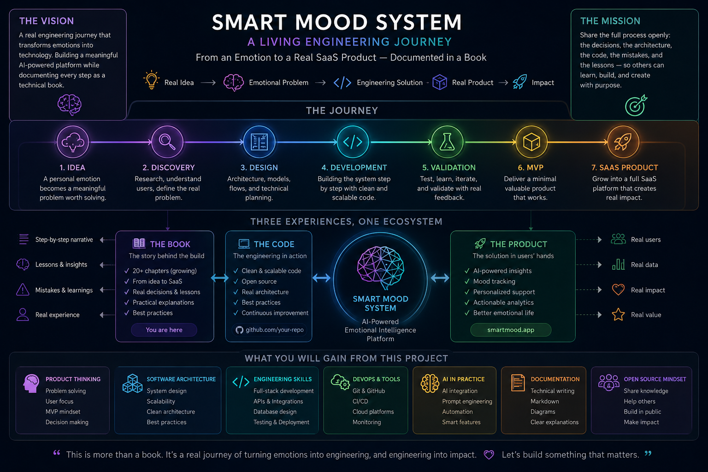

# 📘 Smart Mood System



## 🚀 A Living Engineering Journey

**From an idea to a real SaaS product — documented chapter by chapter.**

Smart Mood System is a unique long-term project that combines:

* 📖 A living technical book
* 🏗️ Real-world software architecture
* 💻 Full-Stack development
* 🤖 AI-assisted engineering
* 🚀 Product creation in public

Unlike traditional books, this project does not describe a finished system.

It documents the actual journey of building one.

Every chapter, architectural decision, design iteration, and development milestone becomes part of both:

1. The Book
2. The Product

---

## 🌐 Live Project

👉 Read the live book:

https://yakov-drilman.github.io/smart-mood-system-book/

---

## 🎯 Project Vision

Transform a human challenge into a software system.

The project follows a complete engineering journey:

```text
Emotion
   ↓
Problem Discovery
   ↓
System Design
   ↓
Architecture
   ↓
Development
   ↓
Prototype
   ↓
SaaS Product
```

The goal is not only to build software, but to document the entire engineering process in public.

---

## 📚 What You Can Learn From This Project

### 🧠 Product Thinking

* Turning ideas into products
* Problem validation
* MVP planning
* User-centered thinking
* Product decision making

### 🏗 Software Architecture

* System design
* Layered architecture
* Frontend / Backend separation
* API design
* Scalability concepts
* Best practices

### 💻 Engineering Skills

* Full-Stack development
* REST APIs
* Database design
* Testing
* Deployment
* Production thinking

### 📄 Documentation & Git

* Technical writing
* Markdown
* Git workflows
* GitHub Pages
* Living documentation
* Building in public

### 🤖 AI in Practice

* AI-assisted development
* Prompt engineering
* AI-powered features
* Human + AI workflows

---

## 📖 What Makes This Project Different?

Most technical books explain a finished system.

Most software projects only show the final result.

Smart Mood System does both at the same time.

The reader can follow:

* The original idea
* The thought process
* Architecture decisions
* Development progress
* Mistakes and lessons learned
* Product evolution

As the system grows, the book grows with it.

---

## 🛠 Technology Stack

Current and planned technologies include:

* Git
* GitHub
* GitHub Pages
* Jekyll
* HTML
* CSS
* JavaScript
* React
* Node.js
* MongoDB
* AI Integrations
* Cloud Infrastructure

---

## 🚧 Current Status

### Completed

* ✅ GitHub repository
* ✅ GitHub Pages deployment
* ✅ Book structure established
* ✅ Responsive documentation website
* ✅ Initial chapters published
* ✅ Custom layouts and navigation

### In Progress

* 🚧 Expanding the book content
* 🚧 Architecture chapters
* 🚧 Product design chapters
* 🚧 Development implementation

### Future Goals

* 🎯 Interactive prototype
* 🎯 Backend services
* 🎯 AI-powered analysis
* 🎯 SaaS platform
* 🎯 Real users and feedback

---

## 📚 Language Note

The book itself is currently written in **Hebrew**.

The project documentation, architecture, and development process are intended to be accessible to a broader technical audience over time.

---

## 💡 Core Principle

> This is not a book about a system.
>
> It is the story of a system being built in real time.

---

## ⭐ Follow The Journey

If you are interested in:

* Product Thinking
* Software Architecture
* Full-Stack Development
* AI Engineering
* Technical Documentation
* Building in Public

then this project is for you.

The journey has only just begun.
